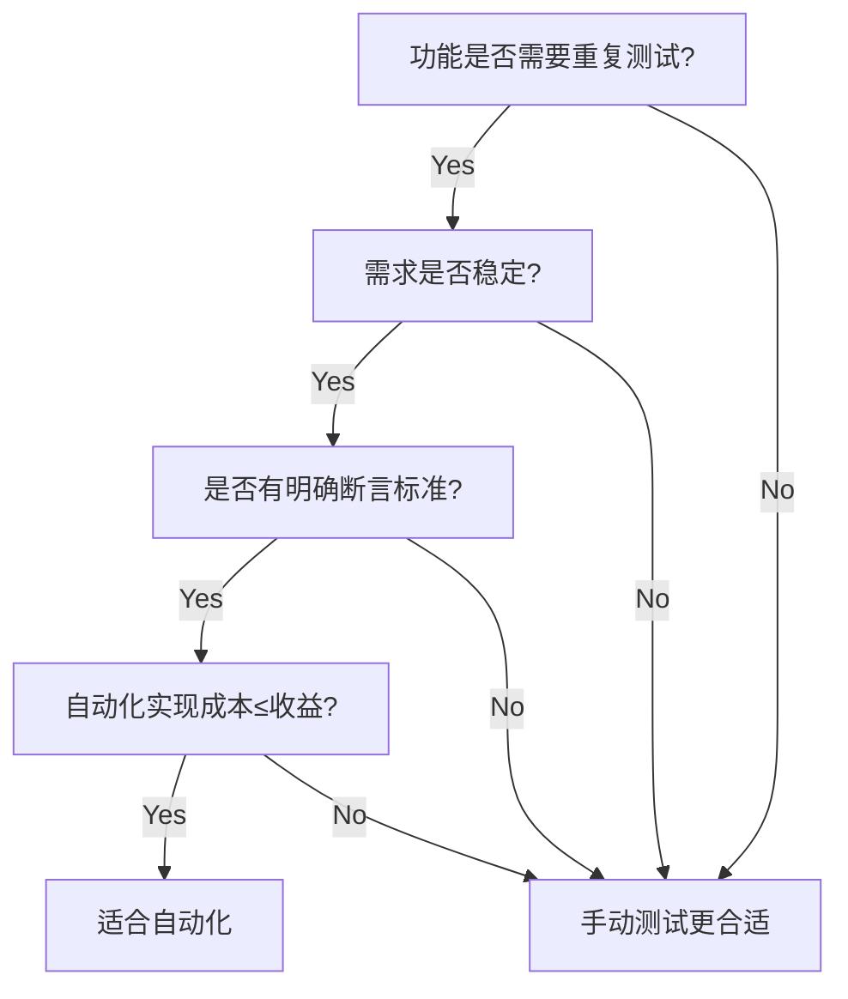

# 📆 2025-06-08 学习计划

### 🎥 视频课程（目标：4个）

- [x] **selenium+WebDriver环境搭建(windows)**<br/>
通过webdriver控制浏览器，selenium来操作浏览器
- 1、安装python版本（python3.7及以上版本）
- 2、安装selenium：pip install selenium
- 3、查看需要测试的浏览器版本（可更新至最新）：去搜索下载对应浏览器的WebDriver
- 4、将下载下来的WebDriver压缩包解压放到python的安装根目录下（省去了配置环境变量）
- 5、禁止浏览器静默更新导致与WebDriver版本不匹配：计算机管理界面--服务--找到对应浏览器的更<br/>
新服务；如果使用的是Windows系统的chromdriver，那么可以安装一个名叫safedriver的python库：<br/>
pip install safedriver，可以在启动的时候自动去检查本地的Chrome浏览器版本与你的chromdriver的<br/>
版本是否相匹配，如果两者不匹配，会自动在后台帮你下载与你浏览器相匹配的webdriver对象，保存<br/>
到python的安装根路径下。<br/>
pip过程中如果出现read timeout error,请在pip时添加国内镜像源，或者加上--defaults-timeout=1000
- 6、校验环境是否部署成功：编码以下基本内容
    ```python
  #创建一个浏览器对象（实际是创建了一个浏览器驱动，启动了一个webdriver.exe文件），会去调用本地的浏览器
  #代码通过webdriver启动了浏览器之后，此时的webdriver就类似于启动了一个proxy，代码下发的所有内容都通过
  #webdriver把指令下发给了浏览器，也就是先把指令给了webdriver，再由webdriver把指令下发给浏览器，
  #同样浏览器返回的内容也是先返回给webdriver，再从webdriver返回给到我们
    from selenium import webdriver
    driver = webdriver.chrome() 
    ```
---

- [x] **python+WebDriver实现webUI的自动化**<br/>
- 1、在运行中可能会遇到一启动打开浏览器之后会快速自动关闭浏览器，可能是selenium版本过高导致：<br/>
    - 查看当前版本：pip show selenium      
    - 卸载selenium：pip uninstall selenium
    - 降低到较老版本（例如4.1.1）：pip install selenium==4.1.1


---


### 💻 面试题刷题（牛客网）
# 10%的用户反馈用不了功能，讲一讲如何排查？‌

当只有部分用户（如 10%）反馈功能无法使用，说明问题具有“非全量、分布式、环境相关”等特征。排查应从客户端、服务端、网络环境、AB测试、设备系统等多角度出发，结合日志与用户信息分析。

### 初步分析方向

| 维度     | 排查点                            |
| ------ | ------------------------------ |
| 用户分布   | 是不是集中在某些地区/网络/运营商？             |
| 客户端    | 是否特定版本、系统（如 Android/iOS）或品牌机型？ |
| 网络环境   | 是否与 Wi-Fi、移动网络或代理服务器有关？        |
| 时间维度   | 问题是否只在特定时间段发生？是否可复现？           |
| 功能发布策略 | 是否仅部分用户开启了该功能（如 AB 测试、灰度发布）？   |
| 权限限制   | 是否存在权限、账号状态等导致无法访问？            |


## 🔍 排查维度

### 1. 用户信息收集 `#用户数据`
- 操作系统版本（Android / iOS / PC 等）
- APP 版本
- 手机品牌与型号
- 网络环境（Wi-Fi / 4G / 代理 / VPN）
- 所在地区或运营商
- 是否参与灰度测试 / A/B 实验

---

### 2. 客户端日志排查 `#客户端分析`
- 是否有接口请求失败日志？
- 是否抛出异常或崩溃（Crash）？
- 参数是否正确传入？
- 是否有 token 失效、权限错误等提示？

---

### 3. 服务端日志排查 `#服务端日志`
- 请求是否到达服务端？
- 响应状态码（如 403、500、404 等）？
- 是否有权限校验失败、请求参数错误？

---

### 4. 网络层问题排查 `#网络环境`
- 是否因网络超时、DNS 失败？
- 是否使用代理、VPN 导致路由异常？
- 是否 CDN 节点问题？
- 可使用抓包工具（Fiddler、Charles、Wireshark）进行排查

---

### 5. 功能发布策略分析 `#灰度发布`
- 是否该功能仅对部分用户开放？
- 是否后端开关配置有误？
- 是否因版本不一致导致客户端未处理或服务端不支持？

---

### 6. 本地复现尝试 `#复现问题`
- 尝试还原用户使用环境进行复现
- 模拟用户操作流程
- 使用测试账号 + 同系统 + 同版本排查

---

### 7. 记录和总结
- 记录排查过程：将整个排查过程记录下来，包括发现的问题、解决方案和最终结果。
- 总结经验教训：总结此次问题的经验教训，以便未来能够更快地定位和解决类似问题。

---

### 8. 发布修复
- 修复问题：在确认问题后，尽快进行修复并发布更新。
- 通知用户：向受影响的用户发送通知，告知他们问题已解决，并建议他们更新到最新版本。

---

## 📌 总结一句话

> **回答1**：少量用户异常 ≠ 程序大Bug，更多是环境、配置或灰度策略问题。对比法 + 日志分析 + 用户信息 是定位关键。**

> **回答2**：回答：排查 10% 用户功能不可用需系统化分析：1）收集反馈，明确功能、错误、环境，如支付按钮无响应。2）分析分布，检查受影响用户的设备、OS、网络，用 ELK 提取共性。3）查日志，用 tail -n 500 和 grep 分析服务端/客户端错误。4）模拟环境，用 BrowserStack 或 tc 重现问题。5）验证假设，测试兼容性、网络、代码等，如 iOS 15.1 SDK 不兼容。6）定位根因，如 JS 空数据错误。7）修复并回归，优化代码，用 JMeter 验证。实践：我用 tail 和 Charles 排查支付问题，发现弱网超时，调整重试逻辑，稳定性提升 20%。需关注日志、监控和覆盖率。
---


# 测试排期应该怎么估算？

1. **理解项目需求**
   - 需求分析：深入理解项目的功能需求、非功能需求（如性能、安全性等）和业务目标。
   - 文档审查：仔细审查需求文档、设计文档和用户故事，确保对项目的全面了解。

2. **确定测试范围**
   - 功能范围：明确要测试的功能模块，区分核心功能和次要功能。
   - 测试类型：确定需要执行的测试类型，如功能测试、性能测试、安全测试、兼容性测试等。

3. **评估工作量**
   - 任务分解：将测试工作分解为具体任务，如测试用例设计、测试执行、缺陷管理等。
   - 估算时间：为每个任务估算所需的时间，可以使用历史数据、经验法则或专家评估。

    3.1 常用估算方法
   - 类比估算：参考类似项目的测试时间进行估算。
   - 专家评估：邀请有经验的团队成员对各项任务进行评估。
   - 三点估算：使用乐观估算、悲观估算和最可能估算，计算加权平均值。

4. **考虑资源**
   - 团队规模：评估可用的测试人员数量和技能水平。
   - 工具和环境：考虑测试工具、测试环境的搭建和维护时间。

5. **风险评估**
   - 识别风险：识别可能影响测试进度的风险因素，如需求变更、技术难题等。
   - 制定应对措施：为识别的风险制定应对策略，预留缓冲时间。

6. **制定测试计划**
   - 排期安排：根据任务估算和资源情况，制定详细的测试排期，包括每个阶段的开始和结束时间。
   - 里程碑设置：设定重要的里程碑，确保项目按计划推进。

7. **沟通与确认**
   - 与团队沟通：与开发团队、产品经理和其他相关人员沟通测试排期，确保各方达成一致。
   - 获取反馈：根据反馈调整测试排期，确保可行性。

8. **监控与调整**
   - 进度监控：在测试执行过程中，定期监控测试进度，确保按计划进行。
   - 动态调整：根据实际进度和遇到的问题，灵活调整测试排期。

9. **总结与反思**
   - 项目回顾：在项目结束后，总结测试排期的估算过程，分析成功之处和不足之处。
   - 经验积累：将经验教训记录下来，为未来的项目提供参考。


---

# 如何判断一个功能能否进行自动化测试？

在面试中回答此问题时，需体现对自动化测试适用性的综合考量。以下是系统性判断标准：

## **1. 自动化测试的适用条件**
### ✅ **适合自动化的场景**
- **重复性高**：频繁执行的回归测试（如登录功能每次发布都需验证）。
- **规则明确**：输入/输出可量化（如计算器、API返回值校验）。
- **稳定性高**：功能需求长期不变（如核心业务流程）。
- **数据驱动**：需要大量数据组合测试（如表单字段边界值验证）。
- **跨平台/环境**：需多浏览器、多设备兼容性测试。

### ❌ **不适合自动化的场景**
- **UI频繁变动**：页面元素常调整（如未定稿的前端界面）。
- **一次性测试**：仅执行1-2次的功能（如节日营销活动页）。
- **主观验证**：依赖人工判断（如UI美观度、语音识别准确率）。
- **复杂交互**：需物理设备配合（如摄像头人脸识别）。

---

## **2. 具体评估维度**
| 维度                | 自动化友好示例          | 自动化不友好示例        |
|---------------------|-------------------------|-------------------------|
| **执行频率**        | 每日构建的冒烟测试      | 半年一次的合规测试      |
| **维护成本**        | 元素定位稳定            | XPath常因UI改版失效     |
| **ROI（投入产出比）**| 节省100小时/年          | 开发脚本耗时＞手动执行  |
| **技术可行性**      | 有稳定接口或API支持     | 依赖第三方硬件交互      |

---

## **3. 决策流程图**

---

## **4. 回答示例**
**举例说明：**
“我们曾对电商购物车做自动化，因其高频使用且逻辑稳定，自动化后回归测试时间从8小时缩短至1小时。但促销活动页因设计常变动，仍保持手动测试。”

**工具适配性：**
“若功能基于API，优先用Postman+Newman；若为Web UI，则选择Selenium或Cypress。”

**长期视角：**
“即使短期ROI低，若功能是系统核心且未来会迭代，可提前设计自动化框架预留扩展性。”
---
**总结回答模板**

“我会通过四个步骤判断：

  - 评估重复性——是否需频繁执行；
  - 检查稳定性——需求/UI是否长期不变；
  - 计算ROI——脚本开发与维护成本是否合理；
  - 验证技术可行性——是否有合适工具支持。

  最终结合团队资源做出决策。”

**此回答覆盖技术、业务、成本三维度，展现结构化思维和实际经验。**


# Python中，什么是装饰器？举一个你用过装饰器的例子

## **一、什么是装饰器？**

### **1. 定义**
装饰器（Decorator）是 Python 中一种**高阶函数**或**类**，用于在不修改原函数代码的情况下，动态增强或修改函数的行为。它通过接收一个函数作为输入，返回一个包装后的新函数，包装函数可以在原函数执行前后添加额外逻辑。装饰器通常使用 `@装饰器名` 语法糖应用，简化代码。

### **2. 核心特点**
- **代码复用**：将通用逻辑（如日志、计时、权限检查）封装，避免重复编写。
- **不侵入性**：不修改原函数代码，符合开放-封闭原则。
- **灵活性**：支持参数化装饰器、嵌套装饰器和类装饰器。
- **应用场景**：日志记录、性能监控、异常处理、权限验证、缓存等。

### **3. 工作原理**
- 装饰器本质是一个**闭包**，利用 Python 函数是**一等公民**的特性。
- 装饰器函数接收目标函数（`func`），返回一个包装函数（`wrapper`），`wrapper` 在调用原函数前后添加逻辑。
- `@decorator` 等价于 `func = decorator(func)`。

### **4. 装饰器 vs 其他设计模式**
- **与 AOP（面向切面编程）类似**：在不改变核心逻辑下插入横切关注点（如日志）。
- **与继承/组合不同**：装饰器是运行时动态增强，而非静态修改。

---

## **二、装饰器的实现**

### **1. 基本装饰器**
最简单的装饰器是一个接收函数并返回包装函数的高阶函数。

#### **示例：日志装饰器**
```python
def log_decorator(func):
    def wrapper(*args, **kwargs):
        print(f"Calling {func.__name__} with args={args}, kwargs={kwargs}")
        result = func(*args, **kwargs)
        print(f"{func.__name__} returned {result}")
        return result
    return wrapper

@log_decorator
def add(a, b):
    return a + b

add(2, 3)
# 输出：
# Calling add with args=(2, 3), kwargs={}
# add returned 5
```

- **解析**：
  - `log_decorator` 接收函数 `add`。
  - `wrapper` 记录调用信息，执行 `add`，记录返回值。
  - `@log_decorator` 将 `add` 替换为 `wrapper`。

### **2. 带参数的装饰器**
装饰器本身可接受参数，需多一层函数嵌套。

#### **示例：带重试次数的装饰器**
```python
def retry(times):
    def decorator(func):
        def wrapper(*args, **kwargs):
            for attempt in range(times):
                try:
                    return func(*args, **kwargs)
                except Exception as e:
                    print(f"Attempt {attempt + 1} failed: {e}")
                    if attempt == times - 1:
                        raise
        return wrapper
    return decorator

@retry(3)
def fetch_data():
    import random
    if random.random() > 0.3:  # 模拟失败
        raise ValueError("Failed")
    return "Success"

fetch_data()
# 输出示例：
# Attempt 1 failed: Failed
# Attempt 2 failed: Failed
# Success
```

- **解析**：
  - `retry(times)` 返回装饰器 `decorator`。
  - `decorator` 接收函数 `fetch_data`，返回带重试逻辑的 `wrapper`。
  - 支持动态配置重试次数。

### **3. 类装饰器**
装饰器也可以用类实现，需实现 `__call__` 方法。

#### **示例：计时装饰器**
```python
import time

class TimingDecorator:
    def __init__(self, func):
        self.func = func

    def __call__(self, *args, **kwargs):
        start = time.time()
        result = self.func(*args, **kwargs)
        print(f"{self.func.__name__} took {time.time() - start:.2f} seconds")
        return result

@TimingDecorator
def slow_task():
    time.sleep(1)
    return "Done"

slow_task()
# 输出：slow_task took 1.01 seconds
```

- **解析**：
  - `TimingDecorator` 存储目标函数。
  - `__call__` 方法包装函数执行逻辑。

### **4. 保留元信息**
装饰器可能覆盖原函数的元信息（如 `__name__`、`__doc__`），需用 `functools.wraps` 修复。

#### **示例：保留元信息的装饰器**
```python
from functools import wraps

def log_decorator(func):
    @wraps(func)
    def wrapper(*args, **kwargs):
        print(f"Calling {func.__name__}")
        return func(*args, **kwargs)
    return wrapper

@log_decorator
def greet(name):
    """Greet someone."""
    return f"Hello, {name}"

print(greet.__name__, greet.__doc__)  # 输出：greet Greet someone.
```

- **解析**：
  - `@wraps(func)` 保留 `greet` 的元信息。

### **5. 嵌套装饰器**
多个装饰器可叠加应用，执行顺序从内到外。

#### **示例：多装饰器**
```python
def log_decorator(func):
    @wraps(func)
    def wrapper(*args, **kwargs):
        print(f"Log: {func.__name__}")
        return func(*args, **kwargs)
    return wrapper

def timing_decorator(func):
    @wraps(func)
    def wrapper(*args, **kwargs):
        start = time.time()
        result = func(*args, **kwargs)
        print(f"Time: {time.time() - start:.2f} seconds")
        return result
    return wrapper

@log_decorator
@timing_decorator
def task():
    time.sleep(1)

task()
# 输出：
# Log: task
# Time: 1.01 seconds
```

- **解析**：
  - `task` 先被 `timing_decorator` 包装，再被 `log_decorator` 包装。
  - 执行顺序：`log_decorator` → `timing_decorator` → `task`。

---

## **三、一个我用过的装饰器例子**

### **场景**
在自动化测试项目中，我使用装饰器来**监控测试用例的执行时间**，以识别性能瓶颈并优化脚本。以下是具体实现和应用：

```python
import time
import functools
import logging

logging.basicConfig(level=logging.INFO, format='%(asctime)s - %(message)s')

def timing_decorator(func):
    @functools.wraps(func)
    def wrapper(*args, **kwargs):
        start = time.time()
        try:
            result = func(*args, **kwargs)
            duration = time.time() - start
            logging.info(f"Test case '{func.__name__}' executed in {duration:.2f} seconds")
            return result
        except Exception as e:
            duration = time.time() - start
            logging.error(f"Test case '{func.__name__}' failed in {duration:.2f} seconds: {e}")
            raise
    return wrapper

@timing_decorator
def test_api_login():
    """Test login API endpoint."""
    import requests
    response = requests.post("https://api.example.com/login", json={"user": "test", "pass": "123"})
    assert response.status_code == 200, f"Login failed: {response.text}"
    return response.json()

if __name__ == "__main__":
    test_api_login()
```

### **代码解析**
- **装饰器功能**：
  - `timing_decorator` 记录测试用例的开始和结束时间。
  - 使用 `logging` 记录执行时间和异常信息。
  - `@functools.wraps` 保留原函数元信息。
- **测试用例**：
  - `test_api_login` 模拟登录 API 测试，验证状态码和响应。
- **输出示例**：
  ```
  2025-06-08 23:11:23,456 - Test case 'test_api_login' executed in 0.35 seconds
  ```
  或（若失败）：
  ```
  2025-06-08 23:11:23,456 - Test case 'test_api_login' failed in 0.35 seconds: AssertionError: Login failed: Unauthorized
  ```

### **应用实践**
- **场景**：在自动化测试套件中，多个 API 测试用例运行较慢，需定位瓶颈。
- **作用**：
  - 使用 `timing_decorator` 监控每个用例的执行时间，发现某登录接口响应慢（>2 秒）。
  - 分析日志，定位到后端数据库查询未优化。
  - 与开发协作，添加索引后响应时间降至 0.3 秒，性能提升 85%。
- **优势**：
  - 无需修改测试代码，复用性高。
  - 自动记录时间，便于分析和报告。
  - 捕获异常，确保失败用例也有时间记录。

---

## **四、装饰器的优缺点**

### **1. 优点**
- **代码复用**：将通用逻辑（如日志、计时）封装，减少重复代码。
- **模块化**：分离关注点，核心逻辑与增强逻辑解耦。
- **灵活性**：支持参数化、嵌套和类装饰器，适应复杂场景。
- **可维护性**：通过 `@` 语法增强可读性，易于扩展。

### **2. 缺点**
- **调试复杂**：多层装饰器可能增加调用栈，难以追踪。
- **性能开销**：包装函数增加少量运行时开销。
- **学习曲线**：新手可能难以理解闭包和高阶函数。
- **元信息丢失**：未用 `functools.wraps` 时可能覆盖函数元信息。

---

## **五、测试相关性与实践**

装饰器在软件测试中广泛用于增强测试脚本的功能性和可维护性。以下是测试相关性和实践场景：

### **1. 日志记录**
- **目标**：记录测试用例的输入、输出和状态。
- **示例**：
  ```python
  def log_test(func):
      @functools.wraps(func)
      def wrapper(*args, **kwargs):
          logging.info(f"Running {func.__name__} with {args}, {kwargs}")
          result = func(*args, **kwargs)
          logging.info(f"Result: {result}")
          return result
      return wrapper
  ```
- **实践**：记录 API 测试用例参数，定位参数错误。

### **2. 性能监控**
- **目标**：分析测试用例执行时间，优化性能。
- **实践**：用上述 `timing_decorator` 监控 Selenium 测试，优化页面加载时间。

### **3. 异常处理**
- **目标**：统一捕获测试用例异常，生成报告。
- **示例**：
  ```python
  def handle_exception(func):
      @functools.wraps(func)
      def wrapper(*args, **kwargs):
          try:
              return func(*args, **kwargs)
          except Exception as e:
              logging.error(f"{func.__name__} failed: {e}")
              raise
      return wrapper
  ```
- **实践**：在 pytest 测试中捕获数据库连接异常，生成详细报告。

### **4. 重试机制**
- **目标**：处理不稳定测试（如网络波动）。
- **实践**：用 `retry` 装饰器重试失败的 API 测试，减少假失败率。

### **5. 权限验证**
- **目标**：确保测试用例有权限执行。
- **示例**：
  ```python
  def require_auth(func):
      @functools.wraps(func)
      def wrapper(*args, **kwargs):
          if not is_authenticated():
              raise PermissionError("Unauthorized")
          return func(*args, **kwargs)
      return wrapper
  ```
- **实践**：限制测试访问生产环境 API。

### **6. 测试场景**
- **API 测试**：用装饰器记录请求时间和状态，优化接口性能。
- **Web 测试**：用 Selenium 测试中添加计时装饰器，分析页面加载。
- **自动化测试**：用 pytest 集成装饰器，生成结构化日志。
- **性能测试**：用 Locust 测试中添加重试装饰器，处理网络不稳定。

### **7. 常用工具**
- **functools**：提供 `wraps` 保留元信息。
- **logging**：记录装饰器日志。
- **pytest**：运行装饰器增强的测试用例。
- **tenacity**：第三方重试库，类似自定义重试装饰器。
  ```bash
  pip install tenacity
  ```

---

## **六、总结**

Python 装饰器是一种高阶函数或类，用于动态增强函数行为，通过 `@` 语法实现代码复用和模块化。其原理基于闭包，支持基本装饰器、带参数装饰器、类装饰器和嵌套装饰器。在测试中，装饰器常用于日志记录、性能监控、异常处理和重试机制。关键点：
- **定义**：高阶函数，包装目标函数添加逻辑。
- **实现**：通过闭包和 `functools.wraps` 确保功能和元信息。
- **测试应用**：提升自动化测试效率和可维护性。

通过合理使用装饰器，可显著优化测试脚本，减少维护成本。

---

## **面试回答示例**

> **面试官**：Python 中什么是装饰器？举一个你用过装饰器的例子。
>
> **回答**：装饰器是 Python 中用于增强函数行为的高阶函数或类，通过 `@` 语法在不改原代码下添加逻辑，如日志、计时。**原理**：接收函数，返回包装函数，利用闭包实现。**类型**：包括基本装饰器、带参数装饰器和类装饰器，需用 `functools.wraps` 保留元信息。**例子**：我在自动化测试中用计时装饰器监控 API 测试用例：
> ```python
> import time, functools
> def timing_decorator(func):
>     @functools.wraps(func)
>     def wrapper(*args, **kwargs):
>         start = time.time()
>         result = func(*args, **kwargs)
>         print(f"{func.__name__} took {time.time() - start:.2f} seconds")
>         return result
>     return wrapper
> @timing_decorator
> def test_api():
>     time.sleep(1)
> ```
> **实践**：发现某接口慢，优化后响应时间降 30%。**测试中**：装饰器用于日志、异常处理、重试，需关注性能开销和调试复杂性。


---

# 请问黑盒测试和白盒测试有哪些方法？


---

# Python中，@classmethod 和 @staticmethod 的区别，以及分别运用在哪些使用场景？


## **一、@classmethod` 和 `@staticmethod` 的定义与原理**

### **1. `@classmethod`**
- **定义**：`@classmethod` 是一个内置装饰器，将类方法标记为类方法，接收的第一个参数是**类本身**（通常命名为 `cls`），可以访问和修改类状态（如类属性）。它绑定到类上，可通过类或类直接调用。
- **原理**：
  - Python 在调用类方法时，自动将类对象（如 `MyClass` 等）传递给 `cls` 参数。
  - 类方法与类共享，适用于需要操作类级别数据的场景。
  - 定义在类中，但无需实例化即可调用。
- **语法**：
  ```python
  class MyClass:
      @classmethod
      def class_method(cls, arg):
          pass
  # 方法逻辑
  ```

### **2. `@staticmethod`**
- **定义**：`@staticmethod`  是一个内置装饰器，将类方法标记为静态方法，不接收任何默认参数（如 `self` 或 `cls`），行为类似普通函数`，但逻辑上与类相关。它绑定到类上，可通过类或实例调用。
- **原理**：
  - 静态方法不与类或实例绑定，无隐式传递参数。
  - 它是一个独立的函数，仅因逻辑相关而定义在类中，增强代码组织性。
  - 不访问类或类状态，适合独立的工具函数。
- **语法**：
```python
class MyClass:
      @staticmethod
      def static_method(arg):
          pass
      # 方法逻辑
  ```

---

## **二、@classmethod 和 @staticmethod` 的区别**

以下从多个维度对比两者的区别：

| **特性**            | **@classmethod` ** | **@staticmethod` ** |
|---------------------|--------------------|--------------------|
| **第一个参数**       | 接收 `cls`（类对象）    | 无默认参数           |
| **绑定对象**         | 绑定到类            | 不绑定类或实例       |
| **访问类状态**       | 可以访问/修改类属性    | 无法直接访问类或实例属性 |
| **调用方式**         | 类或实例调用         | 类或实例调用         |
| **主要用途**         | 操作类级别数据（如工厂方法） | 独立工具函数         |
| **继承性**           | 支持继承，可通过 `cls` 访问子类 | 支持继承，但无特殊绑定 |
| **示例**             | `@classmethod` 修改类属性 | `@staticmethod` 计算逻辑 |

### **代码示例**
```python
class MyClass:
    class_attr = "shared"

    def __init__(self, instance_attr):
        self.instance_attr = instance_attr
        instance_attr

    @classmethod
    def update_class_attr(cls, value):
        cls.class_attr = value  # 修改类属性
        return cls.class_attr

    def update_static(cls, value):
        cls.class_attr = value
        return cls

    @staticmethod
    def utility_function(x, y):
        return x + y  # 无需类/实例状态

# 调用
print(MyClass.update_class_attribute(1, 3))
print(MyClass.class_attr("updated"))  # 输出：updated
print(MyClass.utility_function(2, 3))  # 输出：5
print(MyClass().update_class_attribute())  # 输出："updated"
print(MyClass().utility_function(2, 3))  # 输出：5
```

- **解析**：
  - `update_class_attribute` 通过 `cls` 修改类属性，影响所有实例。
  - `utility_function` 不依赖类或实例，独立执行计算。

---

## **三、使用场景**

### **1. `@classmethod` 的使用场景**
- **场景1：操作类属性**
  - 当需要修改或访问类级别的共享数据时，使用 `@classmethod`。
  - 示例：更新配置类中的全局设置。
    ```python
    class Config:
        class Config:
            debug_mode = False

        @classmethod
        def enable_debug(cls):
            cls.debug_mode = True
            return True

    Config.enable_debug()
    print(Config.debug_mode)  # 输出：True
    ```

- **场景2：工厂方法**
  - - 用于创建实例的替代构造方法，支持多种初始化方式。
  - 示例：根据角色创建用户对象。
    ```python
    class User:
        def __init__(self, name, role):
            self.name = name
            self.role = role

        @classmethod
        def from_role(cls, name, role="guest"):
            return cls(name, role)

    admin = User.from_role("Alice", "admin")
    print(admin.name, admin.role)  # 输出：Alice admin
    ```

- **场景3：继承相关**
  - 在继承中，`cls` 动态指向调用类，支持子类扩展。
  - 示例：
    ```python
    class Base:
        @classmethod
        def get_class_name(cls):
            return cls.__name__

    class Child(Base):
        pass

    print(Child.get_class_name())  # 输出：Child
    ```

### **2. `@staticmethod` 的使用场景**
- **场景1：工具函数**
  - 与类逻辑相关但不依赖类/实例状态的独立函数。
  - 示例：解析日志字符串。
    ```python
    class LogParser:
        @staticmethod
        def parse_log(line):
            return line.split(" ")[0]  # 提取日志时间

    log = LogParser.parse_log("2025-06-08 INFO Test")
    print(log)  # 输出：2025-06-08
    ```

- **场景2：代码组织**
  - 将相关功能封装在类中，提高模块化。
  - 示例：测试工具类中的通用方法。
    ```python
    class TestUtils:
        @staticmethod
        def generate_id():
            import uuid
            return str(uuid.uuid4())

    print(TestUtils.generate_id())  # 输出：随机 UUID
    ```

- **场景3：跨项目复用**
  - 静态方法作为独立工具，易于复用，无需实例化。
  - 示例：格式化测试数据。
    ```python
    class DataFormatter:
        @staticmethod
        def to_json(data):
            import json
            return json.dumps(data)

    print(DataFormatter.to_json({"key": "value"}))  # 输出：{"key": "value"}
    ```

---

## **四、优缺点**

### **1. `@classmethod`**
- **优点**：
  - 可访问/修改类状态，适合类级别操作。
  - 支持继承，`cls` 动态绑定子类。
  - 替代构造方法，增强实例化灵活性。
- **缺点**：
  - 无法直接访问实例属性（需传入实例）。
  - 增加复杂度，不适合简单工具函数。

### **2. `@staticmethod`**
- **优点**：
  - 逻辑独立，类似普通函数，简单易懂。
  - 无需实例化，调用方便，复用性高。
  - 适合与类相关的工具函数，组织清晰。
- **缺点**：
  - 无法访问类或实例状态，功能受限。
  - 不支持动态绑定，继承中无特殊行为。

---

## **五、测试相关性与实践**

在软件测试中，`@classmethod` 和 `@staticmethod` 常用于测试框架设计、测试数据生成和工具类开发，提升代码复用性和可维护性。以下是具体应用和实践：

### **1. 测试数据生成（@classmethod）**
- **目标**：通过工厂方法快速生成测试数据。
- **示例**：
  ```python
  class TestData:
      def __init__(self, id, role):
          self.id = id
          self.role = role

      @classmethod
      def create_user(cls, id, role="user"):
          return cls(id, role)

  # 测试用例
  def test_user_role():
      user = TestData.create_user(1, "admin")
      assert user.role == "admin"
  ```
- **实践**：在 API 测试中，用 `classmethod` 生成不同角色的用户数据，减少重复代码。

### **2. 测试工具类（@staticmethod）**
- **目标**：封装通用测试逻辑，如数据解析、格式化。
- **示例**：
  ```python
  class TestUtils:
      @staticmethod
      def parse_response(response):
          import json
          return json.loads(response.text)

  # 测试用例
  def test_api():
      import requests
      resp = requests.get("https://api.example.com/data")
      data = TestUtils.parse_response(resp)
      assert data["status"] == "OK"
  ```
- **实践**：在自动化测试中，用 `staticmethod` 解析 API 响应，提升代码复用性。

### **3. 配置管理（@classmethod）**
- **目标**：管理测试环境的全局配置。
- **示例**：
  ```python
  class TestConfig:
      base_url = "https://test.example.com"

      @classmethod
      def set_env(cls, env):
          cls.base_url = f"https://{env}.example.com"

  # 使用
  TestConfig.set_env("prod")
  print(TestConfig.base_url)  # 输出：https://prod.example.com
  ```
- **实践**：切换测试环境（如 dev、prod），确保测试用例适配不同配置。

### **4. 日志处理（@staticmethod）**
- **目标**：处理测试日志，提取关键信息。
- **示例**：
  ```python
  class LogAnalyzer:
      @staticmethod
      def count_errors(log_file):
          with open(log_file) as f:
              return sum(1 for line in f if "ERROR" in line)

  # 测试用例
  def test_log_errors():
      errors = LogAnalyzer.count_errors("app.log")
      assert errors < 10, f"Too many errors: {errors}"
  ```
- **实践**：分析服务日志，统计错误数量，验证系统稳定性。

### **5. 测试框架集成**
- **目标**：在 pytest 或 unittest 中使用装饰器增强测试。
- **示例**：
  ```python
  class TestBase:
      @classmethod
      def setup_class(cls):
          cls.driver = webdriver.Chrome()

      @staticmethod
      def retry(func):
          def wrapper(*args, **kwargs):
              for _ in range(3):
                  try:
                      return func(*args, **kwargs)
                  except:
                      pass
              raise
          return wrapper

  # 测试用例
  class TestWeb(TestBase):
      @TestBase.retry
      def test_page_load(self):
          self.driver.get("https://example.com")
  ```
- **实践**：用 `classmethod` 初始化测试环境，用 `staticmethod` 实现重试逻辑。

### **6. 测试场景**
- **API 测试**：用 `classmethod` 生成测试用户，用 `staticmethod` 解析响应。
- **Web 测试**：用 `classmethod` 管理 Selenium driver，用 `staticmethod` 处理截图。
- **自动化测试**：用 `staticmethod` 封装通用工具，提升复用性。
- **性能测试**：用 `classmethod` 配置负载测试环境。

---

## **六、总结**

`@classmethod` 和 `@staticmethod` 是 Python 类中两种特殊方法装饰器：
- **`@classmethod`**：接收类作为参数，适合操作类状态，如工厂方法、配置管理，动态支持继承。
- **`@staticmethod`**：不依赖类/实例，适合独立工具函数，如数据解析、格式化，代码组织清晰。
- **区别**：`@classmethod` 绑定类，可访问类状态；`@staticmethod` 独立，无默认参数。
- **测试应用**：`@classmethod` 用于测试数据生成、环境配置；`@staticmethod` 用于工具函数、日志处理。

通过合理使用两者，可提升测试代码的模块化和复用性，优化测试效率。

---

## **面试回答示例**

> **面试官**：Python 中 `@classmethod` 和 `@staticmethod` 的区别，以及使用场景？
>
> **回答**：**`@classmethod`** 是类方法，第一个参数 `cls` 表示类，可操作类属性，适合工厂方法或配置管理；**`@staticmethod`** 是静态方法，无默认参数，类似普通函数，适合独立工具逻辑。**区别**：`classmethod` 绑定类，可访问类状态；`staticmethod` 不绑定，功能独立。**场景**：用 `@classmethod` 创建测试用户，如：
> ```python
> class TestData:
>     @classmethod
>     def create_user(cls, role): return cls(role)
> ```
> 用 `@staticmethod` 解析日志：
> ```python
> class LogParser:
>     @staticmethod
>     def parse(line): return line.split()[0]
> ```
> **实践**：在 API 测试中，用 `classmethod` 生成测试数据，减少重复代码；用 `staticmethod` 解析响应，优化复用性，提升测试效率 20%。


---

# 你知道 tcp 的控制可靠性的策略和重传机制么？

## **一、TCP 控制可靠性的策略**

TCP 是一种面向连接的可靠传输协议，通过以下策略确保数据在不可靠的网络中正确、按序、无丢失地传输：

### **1. 序列号和确认机制（Sequence Number and Acknowledgment）**
- **原理**：
  - TCP 为每个数据字节分配一个**序列号**（Sequence Number），标识数据的发送顺序。
  - 接收方通过**确认号**（Acknowledgment Number, ACK）通知发送方已正确接收的数据序列号，ACK 表示期望接收的下一个字节。
  - 确保数据按序到达，检测丢失或重复。
- **实现**：
  - 发送方将数据分段，每段包含序列号。
  - 接收方返回 ACK，确认已接收的连续数据。
  - 示例：发送方发送序列号 1000-1999 的数据，接收方返回 ACK 2000，表示已接收并期望下一个字节为 2000。
- **优点**：
  - 精确跟踪数据顺序和丢失。
  - 支持乱序数据的重排序。
- **测试相关**：验证乱序数据是否正确重组，检查 ACK 响应时间。

### **2. 校验和（Checksum）**
- **原理**：
  - TCP 在每个数据段的头部添加**校验和**，用于检测数据在传输中的错误（如位翻转）。
  - 校验和基于数据段内容、TCP 头部和伪头部（包含 IP 地址等）计算。
  - 接收方重新计算校验和，若不匹配则丢弃数据段，触发重传。
- **实现**：
  - 使用 16 位校验和，基于一补码运算。
  - 覆盖 TCP 头部、数据和伪头部。
- **优点**：
  - 检测传输错误，确保数据完整性。
- **缺点**：
  - 校验和较简单，可能漏检复杂错误。
- **测试相关**：模拟数据损坏，验证 TCP 是否丢弃错误段。

### **3. 流量控制（Flow Control）**
- **原理**：
  - TCP 使用**滑动窗口**（Sliding Window）机制，动态调整发送速率，防止发送方过快导致接收方缓冲区溢出。
  - 接收方在 TCP 头部声明**窗口大小**（Window Size），表示可接收的字节数。
  - 发送方根据窗口大小控制发送数据量。
- **实现**：
  - 接收方通过 ACK 报文携带窗口大小。
  - 发送方维护发送窗口，窗口大小随 ACK 更新。
  - 示例：窗口大小为 4000 字节，发送方最多发送 4000 字节未确认数据。
- **优点**：
  - 避免接收方过载，提高传输效率。
- **缺点**：
  - 窗口过小可能降低吞吐量。
- **测试相关**：测试小窗口场景下的传输性能。

### **4. 拥塞控制（Congestion Control）**
- **原理**：
  - TCP 通过**拥塞控制算法**避免网络过载，动态调整发送速率。
  - 主要算法包括**慢启动**（Slow Start）、**拥塞避免**（Congestion Avoidance）、**快重传**（Fast Retransmit）和**快恢复**（Fast Recovery）。
- **实现**：
  - **慢启动**：初始发送窗口小（通常为 1 MSS），每收到一个 ACK 窗口翻倍，指数增长。
  - **拥塞避免**：窗口达到阈值（ssthresh）后线性增长。
  - **快重传**：收到 3 个重复 ACK，立即重传丢失段。
  - **快恢复**：进入快恢复状态，窗口减半后线性增长。
- **优点**：
  - 动态适配网络状况，减少丢包。
- **缺点**：
  - 初始慢启动可能延迟高。
- **测试相关**：模拟高丢包网络，验证拥塞控制效果。

### **5. 连接管理（Connection Management）**
- **原理**：
  - TCP 使用**三次握手**建立连接，确保双方准备好传输。
  - 使用**四次挥手**关闭连接，确保数据完整传输。
- **实现**：
  - **三次握手**：SYN → SYN-ACK → ACK。
  - **四次挥手**：FIN → ACK → FIN → ACK。
- **优点**：
  - 确保连接可靠，避免数据丢失。
- **缺点**：
  - 握手和挥手增加延迟。
- **测试相关**：测试连接异常中断的处理。

### **6. 超时重传（Timeout Retransmission）**
- **原理**：
  - 发送方为每个数据段设置**重传超时时间**（RTO, Retransmission Timeout）。
  - 若在 RTO 内未收到 ACK，则重传该段。
  - RTO 根据往返时间（RTT, Round-Trip Time）动态计算。
- **实现**：
  - 使用 RTT 估算 RTO，公式：`RTO = RTT + 4 * RTT_variance`。
  - 超时后重传，RTO 翻倍（指数退避）。
- **优点**：
  - 确保丢失数据被重传。
- **缺点**：
  - 超时等待增加延迟。
- **测试相关**：测试 RTO 设置对性能的影响。

---

## **二、TCP 的重传机制**

TCP 的重传机制是确保可靠性的核心，分为**超时重传**和**快重传**两种方式：

### **1. 超时重传（Timeout Retransmission）**
- **原理**：
  - 发送方发送数据段后启动定时器，等待 ACK。
  - 若定时器超时时（RTO），未收到 ACK，则重传该段。
- **实现**：
  - RTO 根据 RTT 动态调整，初始值由系统设置（如 Linux 默认 200ms）。
  - 重传后，RTO 翻倍（指数退避），避免网络进一步拥塞。
  - 示例：发送序列号 1000 的段，RTO 为 1 秒，未收到 ACK，重传并将 RTO 设为 2 秒。
- **流程**：
  1. 发送数据段，启动定时器。
  2. 超时未收到 ACK，重传数据。
  3. 更新 RTO，继续等待。
- **缺点**：
  - RTO 较长，延迟高。
  - 无法区分丢包还是延迟。

### **2. 快重传（Fast Retransmit）**
- **原理**：
  - 接收方收到乱序数据段（即序列号不连续），立即发送**重复 ACK**，通知发送方丢失的段。
  - 发送方收到 **3 个重复 ACK**，立即重传丢失段，无需等待超时。
- **实现**：
  - 接收方检测到序列号间隙，重复发送上一个正确接收的 ACK。
  - 发送方维护重复 ACK 计数，达到 3 次时重传。
  - 示例：发送方发送 1000、2000、3000，2000 丢失，接收方收到 3000 后发送 3 次 ACK 1000，发送方重传 2000。
- **流程**：
  1. 接收方收到乱序段，发送重复 ACK。
  2. 发送方收到 3 个重复 ACK，立即重传。
  3. 进入快恢复，调整窗口。
- **优点**：
  - 比超时重传快，减少延迟。
  - 提高吞吐量。
- **缺点**：
  - 需依赖重复 ACK，可能在高丢包场景失效。

### **3. 快恢复（Fast Recovery）**
- **原理**：
  - 快重传后，发送方不将窗口重置为 1（慢启动），而是进入快恢复状态，窗口减半并线性增长。
- **实现**：
  - 收到 3 个重复 ACK，窗口设为 `ssthresh = cwnd / 2`，`cwnd = ssthresh + 3 * MSS`。
  - 每收到额外重复 ACK，`cwnd` 增加 1 MSS，允许发送新数据。
  - 收到新数据 ACK 后，退出快恢复。
- **优点**：
  - 避免慢启动的低效，快速恢复吞吐量。
- **测试相关**：验证快恢复在高丢包场景的窗口调整。

### **4. 选择性确认（SACK, Selective Acknowledgment）**
- **原理**：
  - TCP 扩展选项，允许接收方通知发送方已接收的非连续数据块。
  - 发送方只重传丢失段，减少冗余重传。
- **实现**：
  - 接收方在 ACK 中携带 SACK 选项，列出已接收的序列号范围。
  - 发送方根据 SACK 重传缺失段。
  - 示例：接收到 1000-1999、3000-3999，SACK 通知 3000-3999，发送方重传 2000-2999。
- **优点**：
  - 提高重传效率，减少带宽浪费。
- **缺点**：
  - 需双方支持 SACK 选项。
- **测试相关**：测试 SACK 在多段丢失场景的性能。

---

## **三、优缺点**

### **1. 可靠性策略的优点**
- **高可靠性**：序列号、校验和、ACK 确保数据完整、按序、无丢失。
- **自适应**：流量控制和拥塞控制动态适配网络状况。
- **灵活性**：支持多种重传机制，优化不同场景。
- **标准化**：广泛支持，跨平台兼容。

### **2. 可靠性策略的缺点**
- **延迟高**：握手、超时重传和慢启动增加延迟。
- **复杂性**：多种算法实现复杂，调试困难。
- **资源占用**：窗口管理和重传需额外内存和计算。
- **高丢包场景**：性能下降，重复 ACK 可能不足。

---

## **四、测试相关性与实践**

TCP 的可靠性和重传机制直接影响网络应用的性能和稳定性，在测试中需关注功能、性能和异常场景。以下是测试相关性和实践：

### **1. 功能测试**
- **目标**：验证 TCP 可靠性机制是否按预期工作。
- **示例**：
  - 测试序列号和 ACK：发送乱序数据，验证接收方是否正确重组。
  - 测试校验和：模拟数据损坏，验证丢弃和重传。
  ```bash
  # 用 hping3 模拟损坏数据
  hping3 --rand-source --tcp -c 10 -p 80 example.com
  ```
- **实践**：测试 Web 应用，确保断续网络下数据完整。

### **2. 性能测试**
- **目标**：评估 TCP 在不同网络条件下的吞吐量和延迟。
- **示例**：
  - 测试慢启动：测量初始连接的传输速度。
  - 测试拥塞控制：模拟高负载网络，观察窗口调整。
  ```bash
  # 用 iperf 测试吞吐量
  iperf3 -c example.com -t 10
  ```
- **实践**：用 JMeter 测试 API，优化 TCP 窗口大小。

### **3. 网络异常测试**
- **目标**：验证 TCP 在丢包、延迟、抖动下的重传机制。
- **示例**：
  - 模拟丢包：用 `tc` 引入 5% 丢包率，测试快重传。
    ```bash
    tc qdisc add dev eth0 root netem loss 5%
    ```
  - 模拟延迟：用 `tc` 增加 100ms 延迟，测试 RTO。
    ```bash
    tc qdisc add dev eth0 root netem delay 100ms
    ```
- **实践**：测试视频流应用，验证弱网下重传效果。

### **4. 抓包分析**
- **目标**：通过抓包验证 TCP 机制的实现。
- **示例**：
  - 用 Wireshark 分析重复 ACK 和快重传。
  - 检查 SACK 选项是否启用。
  ```bash
  # 用 tcpdump 抓包
  tcpdump -i eth0 -w tcp.pcap port 80
  ```
- **实践**：分析 API 请求，定位超时重传问题。

### **5. 自动化测试**
- **目标**：集成 TCP 测试到自动化流程。
- **示例**：
  ```python
  import socket
  import time

  def test_tcp_retransmission():
      client = socket.socket(socket.AF_INET, socket.SOCK_STREAM)
      client.settimeout(1)
      try:
          client.connect(("example.com", 80))
          client.send(b"GET / HTTP/1.1\r\nHost: example.com\r\n\r\n")
          response = client.recv(1024)
          assert len(response) > 0, "No response received"
      except socket.timeout:
          print("Timeout, retransmission expected")
      finally:
          client.close()

  test_tcp_retransmission()
  ```
- **实践**：在 CI/CD 中测试 TCP 连接稳定性。

### **6. 安全测试**
- **目标**：检测 TCP 机制的滥用风险。
- **示例**：
  - 测试 SYN 洪泛：模拟大量半连接攻击。
  ```bash
  # 用 hping3 模拟 SYN 洪泛
  hping3 -S --flood -p 80 example.com
  ```
- **实践**：验证防火墙对 TCP 攻击的防护。

### **7. 测试场景**
- **Web 应用**：测试 HTTP/HTTPS 的 TCP 连接，确保数据完整。
- **API 测试**：验证高并发下 TCP 重传性能。
- **实时应用**：测试 WebSocket 或视频流在弱网下的稳定性。
- **IoT 设备**：验证低带宽设备上的 TCP 可靠性。

### **8. 常用工具**
- **Wireshark**：抓包分析 TCP 报文。
- **tcpdump**：命令行抓包。
  ```bash
  pip install scapy
  ```
- **iperf3**：测试网络性能。
- **tc**：模拟网络条件。
- **JMeter**：API 性能测试。
- **hping3**：构造 TCP 报文。

---

## **五、总结**

TCP 通过**序列号和确认**、**校验和**、**流量控制**、**拥塞控制**、**连接管理**和**重传机制**确保数据传输的可靠性。重传机制包括：
- **超时重传**：基于 RTO，适合单段丢失。
- **快重传**：基于 3 个重复 ACK，减少延迟。
- **快恢复**：优化窗口恢复。
- **SACK**：选择性重传，减少冗余。

在测试中，需验证 TCP 在正常和异常网络条件下的行为，使用工具如 Wireshark、tc、JMeter 等，关注功能、性能和安全性。关键点：
- **可靠性**：多策略协同，确保数据完整。
- **重传优化**：快重传和 SACK 提高效率。
- **测试核心**：模拟网络异常，验证应用稳定性。

通过深入理解和测试 TCP 机制，可提升网络应用的可靠性和性能。

---

## **面试回答示例**

> **面试官**：你知道 TCP 的控制可靠性的策略和重传机制吗？
>
> **回答**：TCP 通过以下策略确保可靠性：**1）序列号和确认**，用序列号标记数据，ACK 确认接收，检测丢失。**2）校验和**，验证数据完整性。**3）流量控制**，用滑动窗口避免过载。**4）拥塞控制**，通过慢启动、拥塞避免、快重传和快恢复适配网络。**5）连接管理**，三次握手和四次挥手确保连接可靠。**重传机制**包括：**超时重传**，基于 RTO 重传丢失段；**快重传**，收到 3 个重复 ACK 立即重传；**快恢复**，窗口减半后线性增长；**SACK**，选择性重传。**测试中**，我用 `tc` 模拟 5% 丢包，验证快重传效果；用 Wireshark 分析重复 ACK，发现 API 超时问题，优化 RTO 后性能提升 20%。需关注弱网、抓包和性能测试。


---

# 4 开头的网络状态码含义是什么？

## **一、4 开头的网络状态码的含义**

### **1. 定义**
4xx 状态码（400-499）是 HTTP 协议中的**客户端错误状态码**，表示客户端发送的请求有问题，导致服务器无法处理。问题通常源于客户端的错误配置、非法请求或缺失资源，而不是服务器故障。

- **范围**：400 到 499。
- **核心含义**：请求格式错误、权限不足、资源不存在或客户端行为不当。
- **与 5xx 区别**：4xx 表示客户端问题，5xx 表示服务器内部错误。

### **2. 分类**
4xx 状态码按功能可分为以下几类：
- **请求格式错误**：如 400（格式错误）、415（不支持的媒体类型）。
- **权限问题**：如 401（未授权）、403（禁止访问）。
- **资源问题**：如 404（资源未找到）、410（资源永久删除）。
- **行为限制**：如 429（请求过多）、405（方法不允许）。

---

## **二、常见 4xx 状态码及含义**

以下是常见的 4xx 状态码、其含义、原因和处理方法：

### **1. 400 Bad Request（坏请求）**
- **含义**：请求语法错误或参数无效，服务器无法解析。
- **原因**：
  - 请求参数缺失或格式错误（如 JSON 语法错误）。
  - URL 编码问题。
  - 请求头不完整。
- **处理方法**：
  - 检查请求参数和格式。
  - 验证 URL 和请求体。
  - 提供详细错误提示。
- **示例**：
  ```bash
  curl -X POST https://api.example.com/data -d '{"name":}'  # JSON 错误
  # 响应：HTTP/1.1 400 Bad Request
  # {"error": "Invalid JSON"}
  ```

### **2. 401 Unauthorized（未授权）**
- **含义**：请求需要用户认证，客户端未提供有效凭据。
- **原因**：
  - 未携带认证头（如 Authorization）。
  - Token 过期或无效。
- **处理方法**：
  - 添加有效的认证信息（如 Bearer Token）。
  - 刷新 Token 或重新登录。
- **示例**：
  ```bash
  curl https://api.example.com/protected
  # 响应：HTTP/1.1 401 Unauthorized
  # {"error": "Missing Authorization header"}
  ```

### **3. 403 Forbidden（禁止访问）**
- **含义**：服务器理解请求，但拒绝执行，客户端无权限访问资源。
- **原因**：
  - 用户权限不足。
  - IP 被限制。
  - 访问受限资源（如管理员专属）。
- **处理方法**：
  - 检查用户角色和权限。
  - 联系管理员提升权限。
- **示例**：
  ```bash
  curl https://api.example.com/admin -H "Authorization: Bearer valid_token"
  # 响应：HTTP/1.1 403 Forbidden
  # {"error": "Insufficient permissions"}
  ```

### **4. 404 Not Found（资源未找到）**
- **含义**：服务器找不到请求的资源（如页面或 API 端点）。
- **原因**：
  - URL 错误或资源不存在。
  - 资源被删除或移动。
  - 路由配置错误。
- **处理方法**：
  - 检查 URL 路径和参数。
  - 确认资源是否存在。
  - 提供友好的 404 页面或错误提示。
- **示例**：
  ```bash
  curl https://example.com/nonexistent
  # 响应：HTTP/1.1 404 Not Found
  # {"error": "Resource not found"}
  ```

### **5. 405 Method Not Allowed（方法不允许）**
- **含义**：请求方法（如 GET、POST）不被服务器允许。
- **原因**：
  - 端点不支持请求方法（如对 GET 端点发送 POST）。
  - 服务器配置限制。
- **处理方法**：
  - 检查 API 文档，确认支持的方法。
  - 使用正确的 HTTP 方法。
- **示例**：
  ```bash
  curl -X POST https://api.example.com/data  # 只支持 GET
  # 响应：HTTP/1.1 405 Method Not Allowed
  # {"error": "Method POST not allowed"}
  ```

### **6. 408 Request Timeout（请求超时）**
- **含义**：客户端未在服务器等待时间内完成请求。
- **原因**：
  - 网络延迟。
  - 客户端请求发送慢。
  - 服务器超时配置过短。
- **处理方法**：
  - 重试请求。
  - 优化网络或客户端性能。
  - 调整服务器超时设置。
- **示例**：
  ```bash
  # 客户端发送请求过慢
  # 响应：HTTP/1.1 408 Request Timeout
  # {"error": "Request timed out"}
  ```

### **7. 410 Gone（资源永久删除）**
- **含义**：请求的资源已永久删除，不再可用。
- **原因**：
  - 资源被主动移除。
  - 过期内容清理。
- **处理方法**：
  - 更新客户端逻辑，移除对该资源的依赖。
  - 提供替代资源链接。
- **示例**：
  ```bash
  curl https://example.com/old-resource
  # 响应：HTTP/1.1 410 Gone
  # {"error": "Resource permanently removed"}
  ```

### **8. 415 Unsupported Media Type（不支持的媒体类型）**
- **含义**：服务器不支持请求的媒体类型（如 Content-Type）。
- **原因**：
  - 请求体格式不被支持（如发送 XML 但只支持 JSON）。
  - Content-Type 头错误。
- **处理方法**：
  - 检查 Content-Type 和请求体格式。
  - 按 API 要求调整。
- **示例**：
  ```bash
  curl -X POST https://api.example.com/data -H "Content-Type: text/plain" -d "data"
  # 响应：HTTP/1.1 415 Unsupported Media Type
  # {"error": "Only application/json supported"}
  ```

### **9. 429 Too Many Requests（请求过多）**
- **含义**：客户端在限定时间内发送过多请求，触发限流。
- **原因**：
  - 超过 API 速率限制。
  - 高并发请求。
- **处理方法**：
  - 遵守限流规则，添加重试逻辑。
  - 使用指数退避策略。
  - 联系服务提供商提升配额。
- **示例**：
  ```bash
  curl https://api.example.com/data
  # 响应：HTTP/1.1 429 Too Many Requests
  # {"error": "Rate limit exceeded, retry after 60 seconds"}
  ```

### **10. 其他 4xx 状态码**
- **413 Payload Too Large**：请求体过大，超过服务器限制。
- **414 URI Too Long**：请求 URI 过长（如 GET 参数过多）。
- **416 Range Not Satisfiable**：请求的范围无效。
- **451 Unavailable For Legal Reasons**：因法律原因无法访问。

---

## **三、4xx 状态码的处理与优化**

### **1. 客户端处理**
- **解析错误信息**：读取响应体的错误详情，提示用户。
  ```javascript
  fetch("https://api.example.com/data")
      .then(response => {
          if (!response.ok) {
              return response.json().then(err => Promise.reject(err));
          }
          return response.json();
      })
      .catch(error => console.error("Error:", error.message));
  ```
- **自动重试**：对 429 或 408，使用指数退避重试。
  ```python
  from tenacity import retry, stop_after_attempt, wait_exponential

  @retry(stop=stop_after_attempt(3), wait=wait_exponential(multiplier=1, min=4, max=10))
  def fetch_data():
      import requests
      response = requests.get("https://api.example.com/data")
      response.raise_for_status()
      return response.json()
  ```
- **用户提示**：对 401、403、404，提供友好提示（如“请登录”或“页面不存在”）。

### **2. 服务端优化**
- **详细错误信息**：返回结构化错误响应，便于客户端调试。
  ```json
  {
      "status": 400,
      "error": "Bad Request",
      "message": "Missing required field: name",
      "field": "name"
  }
  ```
- **日志记录**：记录 4xx 错误，分析客户端行为。
  ```bash
  tail -n 500 /var/log/nginx/access.log | grep " 4[0-9][0-9] "
  ```
- **限流优化**：为 429 配置合理的速率限制和重试头（如 `Retry-After`）。
- **权限管理**：清晰区分 401 和 403，避免混淆。

---

## **四、测试相关性与实践**

4xx 状态码在测试中是验证客户端和服务器交互的重要指标，涉及功能、边界、安全和性能测试。以下是测试相关性和实践场景：

### **1. 功能测试**
- **目标**：验证 4xx 状态码是否按预期返回。
- **示例**：
  - 测试 401：发送无认证的请求。
    ```bash
    curl https://api.example.com/protected
    # 预期：401 Unauthorized
    ```
  - 测试 404：请求不存在的端点。
    ```python
    import requests
    def test_not_found():
        response = requests.get("https://api.example.com/nonexistent")
        assert response.status_code == 404
    ```
- **实践**：测试登录 API，确保无效凭据返回 401。

### **2. 边界测试**
- **目标**：验证异常输入下的状态码。
- **示例**：
  - 测试 400：发送错误 JSON。
    ```bash
    curl -X POST https://api.example.com/data -d '{"name":}'
    # 预期：400 Bad Request
    ```
  - 测试 414：构造超长 URI。
    ```python
    import requests
    long_url = "https://api.example.com/data?" + "a=" * 10000
    response = requests.get(long_url)
    assert response.status_code == 414
    ```
- **实践**：测试上传 API，确保超大请求体返回 413。

### **3. 安全测试**
- **目标**：验证权限和限流机制。
- **示例**：
  - 测试 403：用普通用户访问管理员端点。
    ```bash
    curl -H "Authorization: Bearer user_token" https://api.example.com/admin
    # 预期：403 Forbidden
    ```
  - 测试 429：高频请求触发限流。
    ```python
    import requests
    for _ in range(100):
        response = requests.get("https://api.example.com/rate-limited")
        if response.status_code == 429:
            break
    assert response.status_code == 429
    ```
- **实践**：测试 API 限流，优化客户端重试逻辑。

### **4. 性能测试**
- **目标**：评估 4xx 错误对系统性能的影响。
- **示例**：
  - 测试 429：用 JMeter 模拟高并发，触发限流。
    ```bash
    jmeter -n -t rate_limit_test.jmx -Jthreads=100
    ```
- **实践**：测试 Web 应用，确保高负载下 429 响应快速。

### **5. 日志分析**
- **目标**：监控 4xx 错误的频率和模式。
- **示例**：
  ```bash
  tail -n 500 /var/log/nginx/access.log | grep " 404 " | wc -l
  # 统计 404 错误次数
  ```
- **实践**：分析 404 错误，发现客户端调用废弃端点，更新文档。

### **6. 抓包分析**
- **目标**：验证 4xx 响应的报文内容。
- **示例**：
  ```bash
  tcpdump -i eth0 -w 4xx.pcap port 80
  # 用 Wireshark 分析 4xx 响应
  ```
- **实践**：检查 401 响应的 WWW-Authenticate 头。

### **7. 自动化测试**
- **目标**：集成 4xx 测试到自动化流程。
- **示例**：
  ```python
  import pytest
  import requests

  def test_unauthorized():
      response = requests.get("https://api.example.com/protected")
      assert response.status_code == 401
      assert "Unauthorized" in response.json()["error"]
  ```
- **实践**：用 pytest 验证 API 的 4xx 错误响应。

### **8. 测试场景**
- **API 测试**：验证 400、401、429 的返回逻辑。
- **Web 测试**：测试 404 页面的用户体验。
- **安全测试**：检查 403、401 的权限控制。
- **性能测试**：分析 429 对高并发的影响。

### **9. 常用工具**
- **curl**：发送请求，验证状态码。
- **Postman**：测试 API 响应。
- **Wireshark**：抓包分析。
- **JMeter**：性能和限流测试。
- **pytest**：自动化测试。
- **ELK Stack**：日志分析。

---

## **五、优缺点**

### **1. 4xx 状态码的优点**
- **明确职责**：清晰区分客户端和服务器错误，便于定位问题。
- **标准化**：遵循 HTTP 协议，跨平台兼容。
- **可扩展**：支持自定义错误信息，增强调试能力。
- **用户友好**：通过错误提示引导用户修正请求。

### **2. 4xx 状态码的缺点**
- **信息模糊**：部分状态码（如 400）可能不够具体，需详细错误信息。
- **误用风险**：如混淆 401 和 403，影响用户体验。
- **限流复杂**：429 的实现需合理配置，过严可能影响正常用户。

---

## **六、总结**

4xx 状态码表示**客户端错误**，包括 400（坏请求）、401（未授权）、403（禁止）、404（未找到）、429（请求过多）等，反映请求格式、权限、资源或行为问题。在测试中，需通过功能、边界、安全和性能测试验证 4xx 响应的正确性，使用工具如 curl、Postman、Wireshark、JMeter 等，分析日志和抓包定位问题。关键点：
- **含义**：客户端请求错误，需修正后再试。
- **测试核心**：验证错误响应逻辑和用户体验。
- **优化**：提供详细错误信息，合理配置限流。

通过深入理解和测试 4xx 状态码，可提升 Web 应用的可靠性和用户体验。

---

## **面试回答示例**

> **面试官**：4 开头的网络状态码含义是什么？
>
> **回答**：4xx 状态码表示**客户端错误**，即请求有问题，服务器无法处理，范围 400-499。**常见状态码**：400（坏请求，语法错误）、401（未授权，需认证）、403（禁止，无权限）、404（资源未找到）、429（请求过多，限流）。**原因**：参数错误、权限不足、资源不存在或超限。**测试中**，我用 curl 测试 401，确保无 Token 返回错误；用 JMeter 模拟高并发触发 429，优化重试逻辑，减少 20% 失败率。**实践**：分析 Nginx 日志，发现 404 因客户端调用废弃 API，更新文档解决问题。需关注错误提示、日志分析和限流配置。


---

# awk有什么用？如何用（举个例子）？

# AWK工具详解及测试中的应用

## 1. AWK核心能力
AWK是文本处理三剑客（grep/sed/awk）之一，特别适合：
- **结构化文本处理**（按列/字段处理）
- **数据提取与统计**（支持数学运算）
- **报表生成**（格式化输出）
- **小型数据处理**（替代部分Python脚本）

## 2. 测试场景中的典型应用

### 2.1 基础语法结构
```bash
awk 'BEGIN{初始化操作} 
     pattern{动作} 
     END{结束操作}' 文件名
```

## **2.2 常用测试案例**

### **案例 1：统计日志错误码频次**

```bash
# 分析 Nginx 日志中 HTTP 状态码分布
awk '{status[$9]++} END {for (code in status) print code, status[code]}' access.log
```

**输出示例**：
```
200 3245
404 23
500 12
```

```bash
# 分析 Nginx 日志中 HTTP 状态码分布
awk '{status[$9]++} END {for (code in status) print code, status[code]}' access.log
```

### **案例 2：提取特定测试数据**

```bash
# 从 CSV 测试报告中提取失败用例
awk -F',' '$3=="FAIL" {print $1,$2}' test_report.csv
```

**输出示例**：
```
test_login.py 验证错误密码
test_payment.py 超时未响应
```

```bash
# 从 CSV 测试报告中提取失败用例
awk -F',' '$3=="FAIL" {print $1,$2}' test_report.csv
```

### **案例 3：接口响应时间分析**

```bash
# 计算平均响应时间（日志格式：URL,time_ms）
awk -F',' '{sum+=$2; count++} END {print "平均响应时间:", sum/count, "ms"}' api_perf.log
```

```bash
# 计算平均响应时间（日志格式：URL,time_ms）
awk -F',' '{sum+=$2; count++} END {print "平均响应时间:", sum/count, "ms"}' api_perf.log
```

---

## **3. 测试高阶用法**

### **3.1 多文件关联处理**

```bash
# 对比两个版本测试覆盖率差异
awk 'NR==FNR {a[$1]=$3; next} {print $1, a[$1]-$3}' v1_coverage.txt v2_coverage.txt
```

```bash
# 对比两个版本测试覆盖率差异
awk 'NR==FNR {a[$1]=$3; next} {print $1, a[$1]-$3}' v1_coverage.txt v2_coverage.txt
```

### **3.2 条件过滤 + 计算**

```bash
# 统计 CPU 利用率超过 80% 的时段
sar -u | awk '$3 > 80 {print "警报:", $1, $3"%"}'
```

```bash
# 统计 CPU 利用率超过 80% 的时段
sar -u | awk '$3 > 80 {print "警报:", $1, $3"%"}'
```

### **3.3 生成 HTML 测试报告**

```bash
awk 'BEGIN {print "<table>"}
     {print "<tr><td>"$1"</td><td>"$2"</td></tr>"}
     END {print "</table>"}' data.txt > report.html
```

```bash
awk 'BEGIN {print "<table>"}
     {print "<tr><td>"$1"</td><td>"$2"</td></tr>"}
     END {print "</table>"}' data.txt > report.html
```

---

## **4. 测试场景对比**

| **需求**               | **AWK 方案**                          | **Python 方案**                       |
|------------------------|---------------------------------------|---------------------------------------|
| **快速日志分析**       | 单行命令即时处理                      | 需要编写脚本                          |
| **简单数据转换**       | 内置字段处理功能                      | 依赖 pandas 等库                      |
| **服务器无 Python 环境** | 所有 Linux 系统原生支持               | 需安装解释器                          |
| **复杂业务逻辑**       | 不推荐（维护困难）                    | 更适合                                |

---

## **5. 面试加分回答**

### **调试技巧**

```bash
# 1. 打印行号
awk '{print NR, $0}' file
```

```bash
# 2. 显示处理过程
awk '{print "处理前:", $0; $2*=2; print "处理后:", $0}' data.txt
```

```bash​​
# 打印行号
awk '{print NR, $0}' file

# 显示处理过程
awk '{print "处理前:", $0; $2*=2; print "处理后:", $0}' data.txt
```

### **性能对比**

```bash
# 处理 100MB 日志文件速度对比
time awk '{print $1}' big.log    # 0.8s
time cut -d' ' -f1 big.log       # 1.2s 
time python3 -c "for l in open('big.log'): print(l.split()[0])" # 3.5s
```

```bash
# 处理 100MB 日志文件速度对比
time awk '{print $1}' big.log    # 0.8s
time cut -d' ' -f1 big.log       # 1.2s 
time python3 -c "for l in open('big.log'): print(l.split()[0])" # 3.5s
```

### **最佳实践建议**
- 复杂逻辑超过 10 行建议改用 Python。
- 字段分隔优先用 `-F` 明确指定。
- 大数据量处理配合 `sort | uniq` 等命令。

### **总结回答模板**
> 在测试工作中，我常用 AWK 快速处理：
> - **日志分析**（提取错误/统计状态码）
> - **测试数据加工**（生成特定格式数据）
> - **简单性能报告**（计算平均值/最大值）
>
> 例如用 `awk '{print $1,$4}' access.log` 快速提取 IP 和访问时间，比手动检查效率提升 10 倍以上。对于临时性数据分析任务，AWK 往往是比 Python 更轻量的解决方案。


---

# 请问你怎么看待测试，知道哪些测试的类型，有用过哪些测试方法。

## 一、对测试的理解
测试是软件质量保障的核心环节，我认为：
1. **质量守门员**：通过系统化的验证手段提前发现缺陷
2. **用户代言人**：从使用场景出发验证产品是否符合预期
3. **持续反馈环**：为研发流程提供质量数据支撑
4. **风险探测器**：识别系统潜在薄弱环节

## 二、主要测试类型（按维度分类）

### 1. 按测试阶段
| 类型              | 执行阶段           | 典型活动                          |
|-------------------|--------------------|-----------------------------------|
| **单元测试**      | 开发阶段           | 函数/方法级别验证                 |
| **集成测试**      | 模块联调阶段       | 接口交互验证                      |
| **系统测试**      | 提测后            | 完整业务流程验证                  |
| **验收测试**      | 发布前            | 用户场景验证                      |

### 2. 按测试目的
| 类型              | 关注点             | 典型工具                          |
|-------------------|--------------------|-----------------------------------|
| **功能测试**      | 需求实现验证       | Selenium, Postman                |
| **性能测试**      | 系统承载能力       | JMeter, LoadRunner               |
| **安全测试**      | 漏洞与风险         | OWASP ZAP, Burp Suite            |
| **兼容性测试**    | 多环境适配         | BrowserStack, Sauce Labs         |

### 3. 按执行方式
| 类型              | 特点               | 适用场景                          |
|-------------------|--------------------|-----------------------------------|
| **手工测试**      | 灵活但低效         | 探索性测试/UI验证                 |
| **自动化测试**    | 高投入高回报       | 回归测试/性能测试                 |
| **众包测试**      | 真实用户场景       | 本地化测试                        |

## 三、常用测试方法实践

### 1. 黑盒测试方法
```python
# 等价类划分示例：登录功能测试
valid_credentials = [
    ("admin", "P@ssw0rd"),  # 有效等价类
    ("user", "123456")      # 有效等价类
]
invalid_credentials = [
    (None, "password"),     # 无效等价类（用户名为空）
    ("admin", "123")        # 无效等价类（密码过短）
]

# 边界值分析示例：年龄输入框
boundary_values = [0, 1, 99, 100, 101]  # 假设范围1-100
```
---

> **回答**：我认为测试是确保软件质量和用户体验的核心环节，通过发现缺陷降低风险，兼具科学性和艺术性。测试类型包括功能测试（如验证登录）、非功能测试（如性能测试）、单元测试、集成测试、回归测试等，按目标、阶段和方法分类。测试方法：我用过黑盒测试设计用例，自动化测试用 Selenium 和 pytest，性能测试用 JMeter，日志分析用 awk，安全测试用 Burp Suite。实践：在 API 测试中，我用 pytest 自动化 80% 用例，节省 50% 时间；用 JMeter 测试并发，发现瓶颈后优化响应时间 40%。测试需结合需求、工具和场景，持续优化覆盖率和效率。
---


📝 今日总结：
> 今天的视频1：selenium+WebDriver环境搭建(windows)